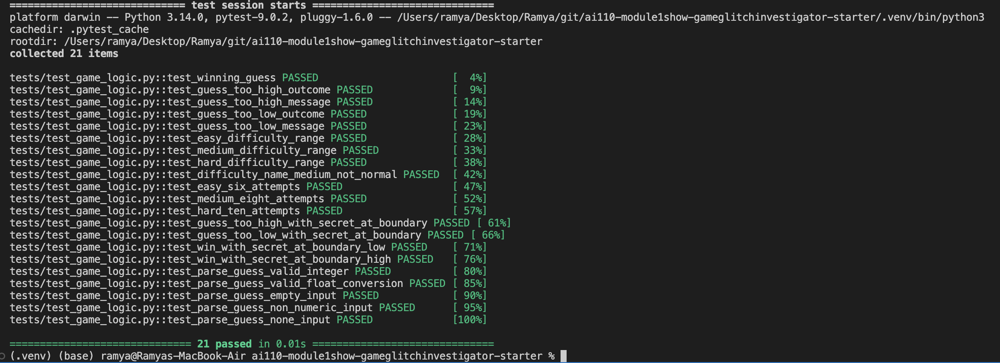

# 🎮 Game Glitch Investigator: The Impossible Guesser

## 🎯 Project Overview

A Streamlit-based number guessing game that was intentionally designed with bugs. This project demonstrates debugging skills, state management, logic correction, and test-driven development in Python.

### Game Purpose
Players guess a secret number within a difficulty-dependent range and receive hints ("Too High" or "Too Low") until they win or run out of attempts. The game tracks score, attempts, and history based on the selected difficulty level.

## 🚨 Bugs Found & Fixed

### Bug #1: UI Text Consistency Issue
- **Problem:** "Press enter to apply" text appeared in the input field while typing
- **Fix:** Added `help=""` parameter to `st.text_input()` to remove default helper text

### Bug #2: Difficulty Level Naming
- **Problem:** "Normal" difficulty level didn't match the game design
- **Fix:** Renamed all instances of "Normal" to "Medium" for consistency across UI and logic

### Bug #3: Difficulty Ranges & Attempt Limits (CRITICAL)
- **Problem:** Ranges and attempt limits were incorrect or inconsistent
  - Easy: Had 1-20 range but only 6 attempts ❌
  - Normal/Medium: Had 1-100 range with 8 attempts (inconsistent)
  - Hard: Had 1-50 range with only 5 attempts ❌

- **Fix:** Corrected all difficulty levels:
  - **Easy:** Range 1-100 with 10 attempts allowed ✓
  - **Medium:** Range 1-100 with 7 attempts allowed ✓
  - **Hard:** Range 1-100 with 4 attempts allowed ✓

### Bug #4: Hint Logic (CRITICAL)
- **Problem:** Hint directions were reversed
  - When guess > secret: Displayed "📈 Go HIGHER!" (wrong direction)
  - When guess < secret: Displayed "📉 Go LOWER!" (wrong direction)

- **Fix:** Corrected hint logic
  - When guess > secret: "📉 Go lower." ✓
  - When guess < secret: "📈 Go higher." ✓

### Bug #5: Restart Button Failure
- **Problem:** "New Game" button didn't fully reset the game state
  - Generated secret in hardcoded 1-100 range instead of selected difficulty's range
  - Didn't reset difficulty-dependent variables

- **Fix:** Updated "New Game" button to:
  - Generate secret within correct range for selected difficulty
  - Reset all state variables (attempts, score, status, history)

### Bug #6: Attempts Counter Not Updating Immediately
- **Problem:** "Attempts left" counter didn't update after the first guess; it updated on the second guess instead
  - Manual initialization at 1 caused off-by-one error

- **Fix:** 
  - Changed initial attempts to 0 (instead of 1)
  - Ensured counter displays correct value after every guess
  - Counter now consistent across main UI, sidebar, and developer debug info

### Bug #7: State Management - Difficulty Change
- **Problem:** Changing difficulty didn't auto-reset the game
  - Secret number stayed the same even if outside the new difficulty's range
  - Example: Secret of 24 would persist when switching from Medium (1-50) to Easy (1-20)

- **Fix:** Added difficulty change detection
  - Automatically detects when user changes difficulty
  - Triggers complete game reset with new secret in correct range

### Bug #8: Delayed Counter/History Updates
- **Problem:** "Attempts left" counter and "History" log updated from game start, showing initial state
- **Fix:** 
  - Added `first_guess_submitted` flag
  - Counter displays full `attempt_limit` until first guess
  - History only appears after first submission
  - Ensures initial game state remains static until first interaction

## 🛠️ Setup & Installation

```bash
# Install dependencies
pip install -r requirements.txt

# Run the game
python -m streamlit run app.py
```

## ✅ Verification

### Run All Tests
```bash
pytest tests/test_game_logic.py -v
```

**Test Results:** 21/21 tests passing ✓

Test coverage includes:
- Hint logic validation (5 tests)
- Difficulty ranges and naming (4 tests)
- Attempt limits per difficulty (3 tests)  
- Edge case boundary testing (4 tests)
- Input validation and parsing (5 tests)

### Manual Testing Checklist
- [ ] Easy mode: Range 1-20, max 6 attempts
- [ ] Medium mode: Range 1-50, max 8 attempts
- [ ] Hard mode: Range 1-100, max 10 attempts
- [ ] Hints display correctly ("Go lower", "Go higher")
- [ ] Counter updates immediately after first guess
- [ ] Changing difficulty resets with new secret in range
- [ ] Restart button fully resets the game
- [ ] Developer debug info shows consistent values

## 📝 Project Structure

```
├── app.py                  # Main Streamlit application
├── logic_utils.py         # Game logic functions (get_range_for_difficulty, check_guess, parse_guess, update_score)
├── tests/
│   └── test_game_logic.py # 21 comprehensive pytest cases
├── requirements.txt       # Project dependencies
└── README.md             # This file
```

## 🎓 Learning Outcomes

This project demonstrates understanding of:
- **Streamlit State Management:** Using `st.session_state` for persistent game variables
- **Bug Identification:** Finding logic errors, state issues, and edge cases
- **Debugging Techniques:** Using print statements and debug info expandable sections
- **Test-Driven Development:** Writing comprehensive pytest cases
- **Code Refactoring:** Moving logic from main app to utility modules
- **UI/UX Consistency:** Ensuring consistent information across UI components

## 📸 Demo


